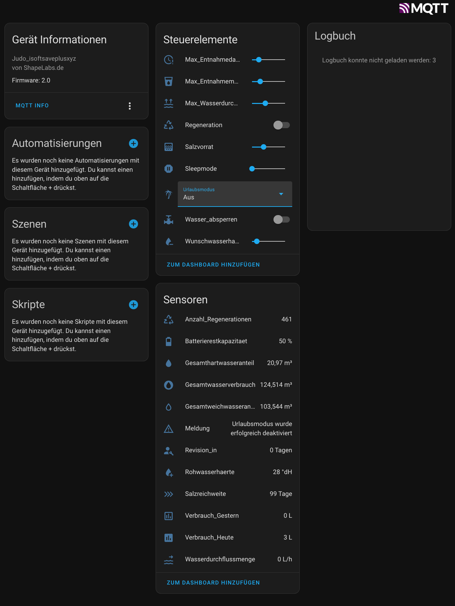

# Judo i-soft save+ to mqtt bridge for homeassistant

This is a small workarount to read and control the Judo isoft safe+ water softener with homeassisant (hassio). It is the version with the small character-lcd and leakage protection.

Unfortunately it is not possible to communicate directly with this version of the plant. Port 8000 and port 8124, through which the system can be read out on the Judo isoft-plus, are closed. The only way to access settings and data is via the cloud server.

Notice:
There are 2 versions of the system, which sound very similar.
- i-soft safe+ (small display, leakage protection) --->This repo
- i-soft plus (large graphic display) ---> another tutorials, like this: https://blog.muwave.de/2017/06/monitoring-and-controlling-a-judo-i-soft-plus-water-softening-device-via-lan/

To do this, you must register the system for the cloud service as described in the user manual and create a user account. There is also a judo smartphone app for this, but it is of course nicer to have everything in homeassisant :-)


I've made two Versions of this Project:

### First Version: esp8266 (legacy)

A small device to write and read settings to Judo i-soft safe+ water softening system with homeassistant.
The hardware of this project consists of an ESP8266 in basic circuitry. You can also just use a node MCU etc.. No further components are necessary.


### Second Version: python

This is a small script which can be executed on any platform. In config_getjudo.py you only have to enter your access data for your myjudo.eu account and the settings for your mqtt broker. 

It may still be necessary to install the paho-mqtt package:
```
$sudo pip install paho-mqtt
```
After that you can start the script. On Linux platforms it is best to include it in the systemd-manager:

Copy/Clone the getjudo.py and the config_getjudo.py to your home-folder or wherever you want. Then create a new systemd-service:
```
$sudo nano /etc/systemd/system/getjudo.service
```
```
[Unit]
Description=getjudo service
After=multi-user.target
[Service]
Type=simple
Restart=always
ExecStart=/usr/bin/python3 /home/<username>/getjudo.py
[Install]
WantedBy=multi-user.target
```
User rights may still need to be assigned:
```
sudo chmod +x /etc/systemd/system/getjudo.service && chmod +x ~/*getjudo.py
```

Reload the daemon:
```
$sudo systemctl daemon-reload
```

Enable the autostart, if our platform restarts e.g.:
```
$sudo systemctl enable getjudo.service
```
Start the service:
```
$sudo systemctl start getjudo.service
```

### Config (ESP8266)
It is necessary to generate a token. To do this, log into the cloud service with your user account on https://www.myjudo.eu.
After the successful login, you can copy the hexadecimal-token (just take the "knmtoken" not the "judotoken") from the URL in the address bar of the browser.
The token must then be inserted under TOKEN in the code.
The token can be used to create a URL that can also be used to read out the serial number and all other data:
https://www.myjudo.eu/interface/?token=INSERT_TOKEN_HERE&group=register&command=get%20device%20data
As a response you get the complete data set, which also contains the serial number of the device at the beginning, which must then be entered in the code under SERIALNUMBER. The software can now be flashed into the ESP


### Startup
Afterwards the device should set itself up automatically with mqtt-autoconfig in homeassitant with all entities:



- reading (sensors): 
  - next revision
  - total water consumption
  - total softwater consumption
  - total hardwater consumption
  - salt range
  - output hardness
  - input hardness
  - water flow
  - capacity of battery
  - number of regenerations
  - daily consumption (today)
  - daily consumption (yesterday)
- writing:
  - leakage protection (switch)
  - output hardness (input number slider)
  - salt stock (input number slider)
  - triggering regeneration (switch)
  - sleepmode (input number slider) (start sleepmode by setting hours) 
  - max. extraction time, leakage protection config (input number slider)
  - max. extraction quantity, leakage protection config (input number slider)
  - max. waterflow, leakage protection config (input number slider)
- other:
  - Error- and warning messages of plant published to notification topic (LOCATION/NAME/notify). Can be used for hassio telegram bot


This Project based of informations from:
- https://blog.muwave.de/2017/06/monitoring-and-controlling-a-judo-i-soft-plus-water-softening-device-via-lan/
- https://forum.fhem.de/index.php/topic,115696.15.html
- https://knx-user-forum.de/forum/projektforen/edomi/1453632-lbs19002090-judo-i-soft-wasserenth%C3%A4rtungsanlage/page2
- https://github.com/arteck/iobroker.judoisoft/blob/master/lib/dataConverter.js

Many thanks to this guys!!!

